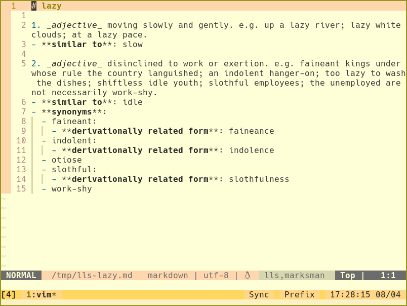

# LLS - Language Language-Server

_This is beta software, use at your own risk_

Language servers provide a convenient solution to the problem of language support for various editors.

Language servers are commonly used for programming languages but why not natural language too?

This project aims to provide an example of a language server for English, using wordnet for support.



## Actions

- `hover` shows meaning of the word
- `gotoDefinition` of a word for all info about it
    - also available through code actions to avoid conflicts
- completion for words

## Installation

### Cargo

Currently, the main way to install LLS is by cloning the repo and running

```sh
cargo install --path . --force
```

This adds the binary `lls` to the rust bin location.

## Configuration

You'll need to download a copy of [wordnet](https://wordnet.princeton.edu/download/current-version).
The tested version is 3.1.

To configure the location of the wordnet dictionary set the `initializationOptions` as:

```json
{
  "wordnet": "<location>"
}
```

Home dir (`~`) should get expanded if needed.

Capabilities are all enabled by default, but can be disabled in the `initializationOptions` (e.g. to prevent conflicting handling of hover or gotoDefinition):

```json
{
  "wordnet": "<location>",
  "enable_completion": false,
  "enable_hover": false,
  "enable_code_actions": false,
  "enable_goto_definition": false
}
```

### Neovim

For debugging and quickly adding it to neovim you can use the provided `vim.lua` file, provided you have `nvim-lspconfig`.

```sh
nvim LLS.txt
# then :LspStop
# then :luafile vim.lua
# then :LspStart
# Write some words and hit K to hover one using LLS
```

It by default is set up for the `text` and `markdown` filetypes.

## WordNet

For more information about the WordNet database see [here](https://wordnet.princeton.edu/).
